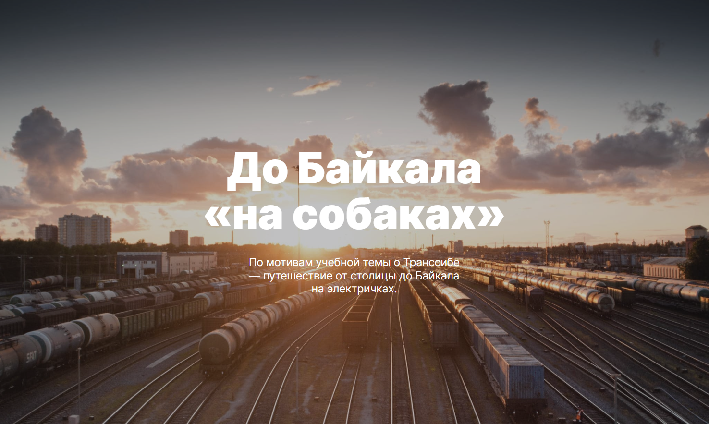

## Russian Travel
------
🏕Учебный проект, выполняемый в рамках учебы в Яндекс.Практикум по специальности web-разработчик. Основная задача проекта - реализовать на практике полученные теоретические знание по web-разработке, а именно адаптивная верстка.

[Демонстрация работы проекта на Github Pages](https://mikhailyandex.github.io/russian-travel/)

### Используемые технологии
* HTML5
* CSS3
* Flexbox
* Grid Layout
* BEM-методология
* Файловая структура проекта по правилам Nested БЭМ

**О проекте**
Мобильная адаптивная вёрстка по макету в Figma.
Контрольные точки: 320, 768, 1024, 1280px.

* [Ссылка на макет в Figma](https://www.figma.com/file/5S2WSbEFL6awjVWJ0NWL8Q/Sprint-3_-Russia-_-desktop-mobile?node-id=28503%3A0)
